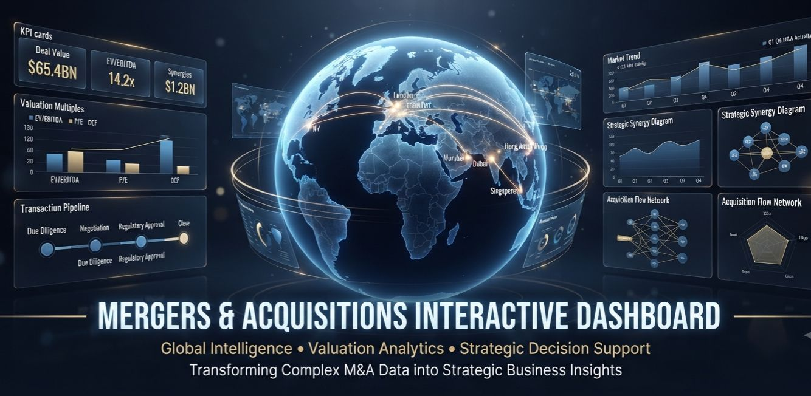
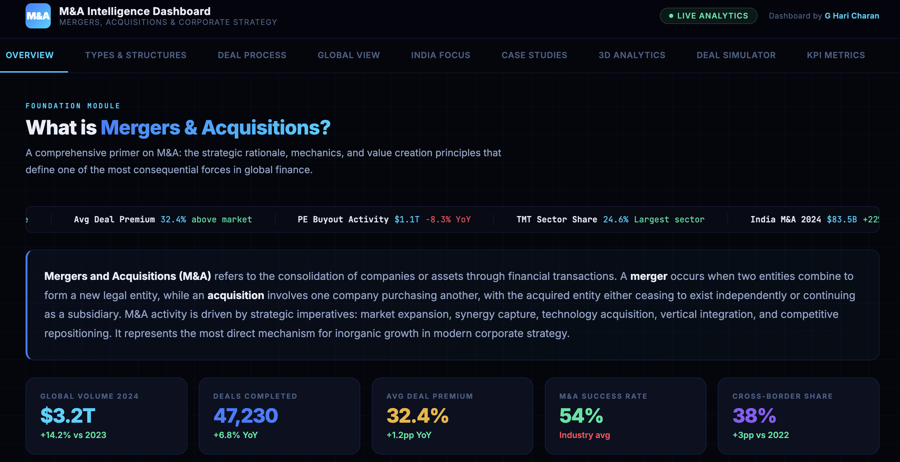
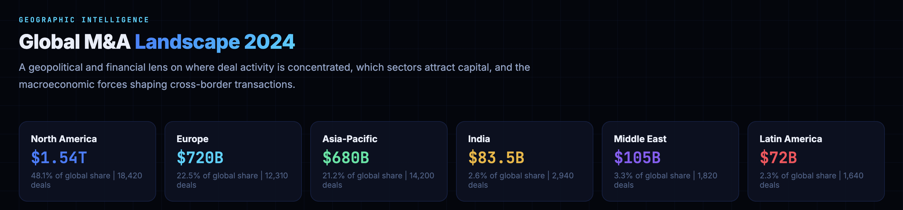
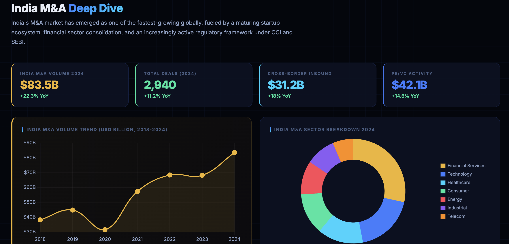
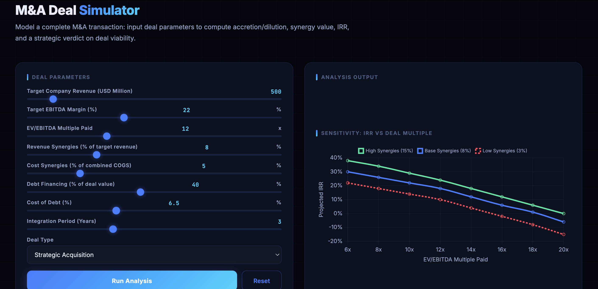

<p align="center">
  
</p>

<h1 align="center">Mergers & Acquisitions Interactive Dashboard</h1>

<p align="center">
An interactive business intelligence dashboard that explores the complete mergers and acquisitions lifecycle through valuation analytics, strategic insights, global transaction intelligence, and immersive financial visualization.
</p>

<p align="center">
<a href="https://urstrulyghc-5.github.io/mergers-acquisitions-interactive-dashboard/"><strong>Live Dashboard</strong></a>
</p>

---

# 1. Project Overview

The **Mergers & Acquisitions Interactive Dashboard** is an interactive financial analytics platform developed to simplify complex M&A concepts through modern visualization and strategic analysis.

The dashboard combines corporate finance, valuation methodologies, business intelligence, and interactive analytics into a unified experience, enabling users to explore the complete acquisition lifecycle from strategic rationale to post-merger evaluation.

---

# 2. Objectives

The project aims to:

- Present the complete M&A ecosystem through an interactive dashboard.
- Demonstrate valuation and strategic decision-making techniques.
- Compare global and Indian mergers and acquisitions.
- Visualize financial data through dynamic charts and analytics.
- Enhance understanding of corporate restructuring and investment strategy.

---

# 3. Dashboard Modules

## 3.1 Overview

- Live market ticker
- Executive KPI cards
- Strategic rationale analysis
- Animated financial charts
- Market summary

## 3.2 Types of Mergers & Acquisitions

- Horizontal Mergers
- Vertical Mergers
- Conglomerate Mergers
- Market Extension
- Product Extension
- Reverse Mergers
- Payment Structure Analysis

## 3.3 M&A Process

- Seven-stage acquisition lifecycle
- Due diligence framework
- Valuation methodologies
- Process timeline
- Financial evaluation

## 3.4 Global M&A Intelligence

- Regional transaction analysis
- Cross-border acquisition trends
- Global sector comparison
- Top historical transactions
- Strategic market drivers

## 3.5 India Market Analysis

- HDFC Bank and HDFC Ltd merger
- Indian transaction trends
- Sector analysis
- Strategic observations

## 3.6 Case Studies

Interactive analysis of:

- Microsoft – Activision Blizzard
- JPMorgan Chase – Bear Stearns
- Meta – Instagram
- Vodafone – Idea

## 3.7 3D Analytics Radar

- Interactive Three.js globe
- Regional transaction intelligence
- Multiple visualization modes
- Business analytics exploration

## 3.8 Deal Simulator

Interactive financial modelling including:

- Internal Rate of Return (IRR)
- Synergy estimation
- Accretion and dilution analysis
- Payback period
- Investment recommendation

## 3.9 KPI Performance Metrics

- Executive benchmarking
- Financial indicators
- Comparative analytics
- Performance trends

---

# 4. Key Features

- Interactive single-page dashboard
- Corporate finance focused analytics
- Global and Indian market comparison
- Business valuation framework
- Real-world acquisition case studies
- Three.js powered 3D analytics
- Financial deal simulation
- Executive KPI reporting
- Responsive dashboard interface

---

# 5. Technology Stack

| Technology | Purpose |
|------------|---------|
| HTML5 | Application Structure |
| CSS3 | User Interface |
| JavaScript | Interactive Functionality |
| Three.js | 3D Visualization |
| SVG | Interactive Charts |
| GitHub Pages | Deployment |

---

# 6. Showcase

### Dashboard Overview



### Global M&A Intelligence



### India Market Analysis



### Deal Simulator



---

# 7. Project Structure

```text
mergers-acquisitions-interactive-dashboard/

├── index.html
├── README.md
├── LICENSE
└── showcase/
    ├── ma.png
    ├── dashboard-overview.png
    ├── global-ma-intelligence.png
    ├── india-ma-analysis.png
    └── deal-simulator.png
```

---

# 8. Live Demonstration

**Live Dashboard**

https://urstrulyghc-5.github.io/mergers-acquisitions-interactive-dashboard/

---

# 9. Learning Outcomes

This project demonstrates practical knowledge in:

- Mergers and Acquisitions
- Corporate Finance
- Business Valuation
- Strategic Management
- Business Intelligence
- Financial Analytics
- Interactive Dashboard Development
- Data Visualization

---

# 10. Future Scope

- Real-time financial market integration
- Additional valuation techniques
- AI-assisted strategic analysis
- Predictive financial analytics
- Exportable analytical reports
- Advanced benchmarking

---

# 11. License

This project is distributed under the MIT License.

---

# 12. Author

**G Hari Charan**

MBA | Finance | Business Analytics 

GitHub Profile

https://github.com/urstrulyghc-5

Project Repository

https://github.com/urstrulyghc-5/mergers-acquisitions-interactive-dashboard

Live Dashboard

https://urstrulyghc-5.github.io/mergers-acquisitions-interactive-dashboard/

---

**Disclaimer**

This dashboard has been developed for educational, analytical, and portfolio purposes. The visualizations, valuation techniques, case studies, and strategic insights are intended to demonstrate concepts in mergers and acquisitions, financial analysis, business intelligence, and interactive dashboard design.
